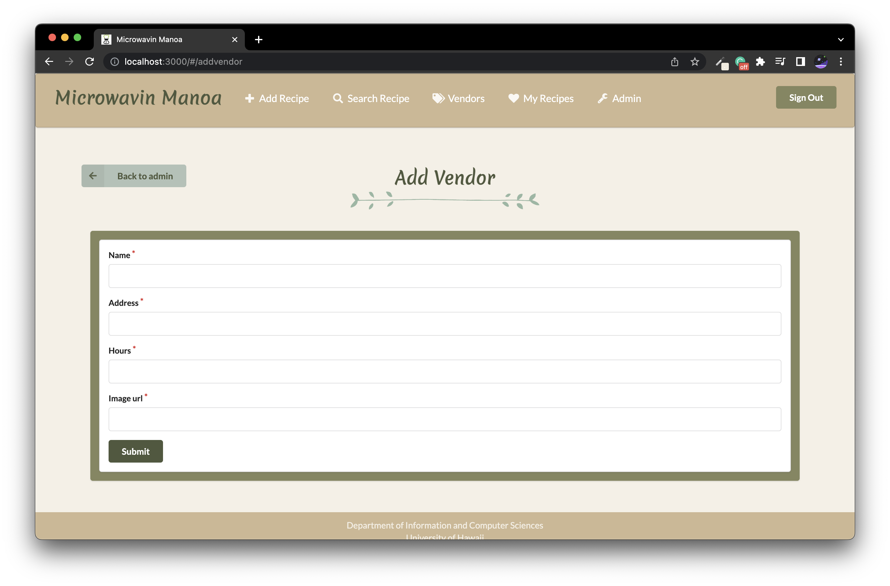

# Microwavin Manoa
## Table of contents

* [Overview](#overview)
* [Deployment](#deployment)
* [User Guide](#user-guide)
* [Community Feedback](#community-feedback)
* [Developer Guide](#developer-guide)
* [Development History](#development-history)
* [Team](#team)

## Overview

Many college students have limited kitchen resources, limited cooking skills, limited time, limited access to grocery stores, and no access to creative recipes that respect these constraints. As a result, college students spend money to eat out, or eat non-healthy foods at fast food places or through vending machines.

Microwavin Manoa creates a way for students (on-campus or off) to learn and share recipes that:
* Can be made using minimal kitchen facilities (at a minimum, a toaster oven, or a microwave!).
* Can be made out of ingredients that are available within walking distance of UH.
* Suit local taste sensibilities.
* Can be filtered via dietary restrictions (gluten-free, vegan, etc).
* Have an estimated cost per serving.
* Has an estimated number of servings per recipe.
* Has an estimate of how long it takes to make.

Technologies we plan on using for "Microwavin Manoa":

* [Meteor](https://www.meteor.com/) for Javascript-based implementation of client and server code.
* [React](https://reactjs.org/) for component-based UI implementation and routing.
* [Semantic UI React](https://react.semantic-ui.com/) CSS Framework for UI design.
* [Uniforms](https://uniforms.tools/) for React and Semantic UI-based form design and display.

## Deployment
[Microwavin' Manoa](https://microwavinmanoa.me/#/) website, deployed from Digital Ocean.

## User Guide
A walkthrough for the Microwavin Manoa user interface.

### Landing Page

The landing page is the first page presented when users visit the URL.


### Signup and Signin Page
If you were previously registered, you are able to "Login" by clicking the button on the upper right button on the navbar.
If not, you are able to make an account by clicking "Sign up".


### User Home Page
After successfully logging in as a User, the system takes you to user home page. It is like the landing page, but the NavBar contains links to add recipe, search recipe, all vendors, and my recipes.


### Admin Home Page
When a user has the admin role, they have an 'Admin' link in the NavBar that lets them view and edit all recipes for all users, along with the ability to add and edit vendors. 


### Add Recipe Page
After logging in, Users and Admins are able to add recipes. If an ingredient that they want for the recipe is not already in the system, there is a popup to add an ingredient with a certain vendor and price. Now the ingredient will be available to select for the recipe's ingredients.


### Search Recipe Page
On this page, Users or Admins can see all recipes in the system (alphabetized for easier lookup). Recipes can also be filtered by their respective tags.


### Individual Recipe Page
Upon clicking a recipe, the page will display all information for that recipe. This includes the name, image, ingredients, tags, and description. Additionally, there is a table to easily look up all the required ingredients, where to get them, and at what price. This table includes the link to the vendor where the ingredient can be bought. Using this information, the lowest total cost to make a recipe is calculated using the lowest price for each ingredient.


### All Vendors Page
Both Users and Admins can access a page to see all the vendors in the system.


### Vendor Profile Page
Upon clicking on a vendor, the page will display information for that vendor. This includes the name, image, address, hours, and all available ingredients and their prices. Here, the prices of ingredients can be updated, and new ingredients can be added to that particular store.


### My Recipes Page
On this page, Users have access to all the recipes they have created. Here, they can also edit the recipes they have made.


### Admin Page
On this page, Admins can see all recipes and vendors in the system. For easier navigation there is a tag on the side to navigate between the two. Here, recipes can be edited, and vendors can be added and edited.


### Edit Recipe Page
Both Users and Admins can be redirected to this page to edit an existing recipe.


### Add Vendor Page
Admins can add new vendors into the system with a name, address, image, and hours.



### Edit Vendor Page
Admins can edit existing vendors.


## Community Feedback
Coming soon!

## Developer Guide

### Installation

First, [install Meteor](https://www.meteor.com/install).

Second, [download a copy of Microwavin Manoa](https://github.com/microwavin-manoa/microwavin-manoa).

Third, cd into the app directory and install the required libraries with:

```
$ meteor npm install
```
Additionally, you may need to run this command:
```
$ meteor npm install --save react-router-hash-link
```

### Running the system

Once the libraries are installed, you can run the application by invoking:

```
$ meteor npm run start
```

#### Note regarding "bcrypt warning":

You might also get the following message when you run this application:

```
Note: you are using a pure-JavaScript implementation of bcrypt.
While this implementation will work correctly, it is known to be
approximately three times slower than the native implementation.
In order to use the native implementation instead, run

  meteor npm install --save bcrypt

in the root directory of your application.
```

On some operating systems (particularly Windows), installing bcrypt is much more difficult than implied by the above message. Bcrypt is only used in Meteor for password checking, so the performance implications are negligible until your site has very high traffic. You can safely ignore this warning without any problems during initial stages of development.

### Viewing the running app

If all goes well, the template application will appear at [http://localhost:3000](http://localhost:3000).  You can login using the credentials in [settings.development.json](https://github.com/microwavin-manoa/microwavin-manoa/blob/master/config/settings.development.json), or else register a new account.

### ESLint

Lastly, you can run ESLint over the code in the imports/ directory with:

```
meteor npm run lint
```

## Development History

[GitHub Organization](https://github.com/microwavin-manoa) of Microwavin-Manoa containing all its repositories.

The development process for Microwavin Manoa conformed to [Issue Driven Project Management](http://courses.ics.hawaii.edu/ics314f19/modules/project-management/) practices. In a nutshell:

* Development consists of a sequence of Milestones.
* Each Milestone is specified as a set of tasks.
* Each task is described using a GitHub Issue, and is assigned to a single developer to complete.
* Tasks should typically consist of work that can be completed in 2-4 days.
* The work for each task is accomplished with a git branch named "issue-XX", where XX is replaced by the issue number.
* When a task is complete, its corresponding issue is closed and its corresponding git branch is merged into master.
* The state (todo, in progress, complete) of each task for a milestone is managed using a GitHub Project Board.

The following sections document the development history of Microwavin Manoa.

### Milestone 1

The goal of Milestone 1 to form an idea how the site would be set up along with developing very basic mockups for the pages and starting work on the different Mongo collections.

Milestone 1 was managed using [Microwavin Manoa GitHub Project Board M1](https://github.com/microwavin-manoa/microwavin-manoa/projects/1):


### Milestone 2

The goal of Milestone 2 was adding more functionality to the site by making various calls to the Mongo database. Another goal improve the overall UI design of the site.

Milestone 2 was managed using [Microwavin Manoa GitHub Project Board M2](https://github.com/microwavin-manoa/microwavin-manoa/projects/2):
add picture here!!!!

### Milestone 3

Milestone 3 is currently being using [Microwavin Manoa GitHub Project Board M3](https://github.com/microwavin-manoa/microwavin-manoa/projects/3)

## Team
* [Kailee Hung](https://kaileehung.github.io/), [Carol Wong](https://carolwong492.github.io/), [Jiahui Liao](https://jiahuiliao.github.io/), [Kristyn Mimura](https://kristyn-mimura.github.io/)
* [Team Contract](https://docs.google.com/document/d/1M3Itsauhm6VcdMkSpO9jBSF_vA0zvCPWDgKkCVhjftk/edit?usp=sharing)
